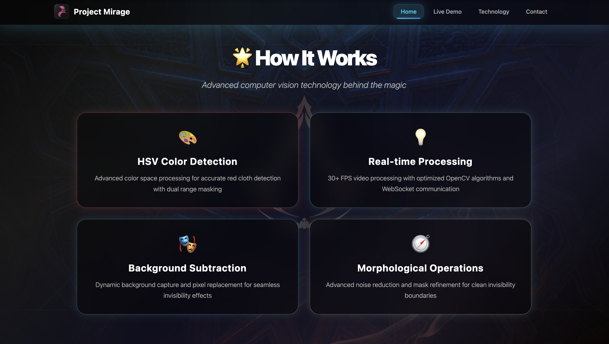

<h1 align="center">🎭 Project Mirage — AI-Powered Invisibility Cloak System</h1>

<p align="center">
  ✨ A cutting-edge computer vision application that creates real-time invisibility effects using advanced OpenCV algorithms and HSV color detection technology.
</p>

<p align="center">
  
  
  
  
  
  
</p>
<br>

---

## 🎯 Problem Statement
Traditional invisibility effects in movies require expensive green screens and post-production editing. Our solution brings real-time invisibility effects to anyone with a webcam and colored cloth, making magic accessible to everyone.

<br>

---

## 💡 Our Solution
Project Mirage is an advanced computer vision application that:

- 🎥 Creates real-time invisibility effects using webcam input
- 🌈 Supports multiple color detection (Red, White, and more)
- 🔄 Dynamic background capture with SPACEBAR functionality
- 🎭 Advanced HSV color space processing for accurate detection
- ⚡ Real-time video processing with optimized algorithms
- 🌐 Modern web interface with React frontend
<br>

---  

## 🚀 Features

✅  **Real-time invisibility effects** with 30+ FPS performance  
✅  **Red color cloth detection** using HSV color space  
✅  **Advanced morphological operations** for noise reduction  
✅  **HSV color space processing** for accurate detection  
✅  **Modern web interface** with React and FastAPI  
✅  **WebSocket communication** for real-time processing  
✅  **Clean code structure** with professional UI/UX

<br>

---  

## 🛠️ Tech Stack

<div align="center">

<table>
<thead>
<tr>
<th>🖥️ Technology</th>
<th>⚙️ Description</th>
</tr>
</thead>
<tbody>
<tr>
<td></td>
<td>Core programming language for computer vision</td>
</tr>
<tr>
<td></td>
<td>Modern frontend with component architecture</td>
</tr>
<tr>
<td></td>
<td>High-performance Python backend with WebSocket</td>
</tr>
<tr>
<td></td>
<td>Advanced computer vision and image processing</td>
</tr>
<tr>
<td></td>
<td>High-performance numerical computing</td>
</tr>
<tr>
<td></td>
<td>Real-time bidirectional communication</td>
</tr>
</tbody>
</table>

</div>

<br>

---

## 📁 Project Directory Structure

```
Project Mirage — Invisibility Cloak System/
├── 📂 backend/                      # 🐍 Python FastAPI server
│   ├── 📄 main.py                  # 🎭 Invisibility processing API
│   ├── 📄 run.py                   # 🚀 Server startup script
│   └── 📄 requirements.txt         # 📦 Python dependencies
├── 📂 frontend/                     # ⚛️ React web application
│   ├── 📂 public/
│   │   └── 📄 index.html           # 🌐 HTML template
│   ├── 📂 src/
│   │   ├── 📄 App.js               # ⚛️ Main React component
│   │   ├── 📄 App.css              # 🎨 Modern styling
│   │   ├── 📄 HowItWorks.css       # 🎨 Additional styling
│   │   └── 📄 index.js             # 🚀 Entry point
│   ├── 📄 .env.production          # 🔐 Production environment
│   ├── 📄 package.json             # 📦 React dependencies
│   └── 📄 package-lock.json        # 🔒 Dependency lock file
├── 📂 docs/                        # 📸 Documentation and screenshots
│   ├── 📄 Features_Page.png        # 🖼️ Features page screenshot
│   ├── 📄 Home_Page.png            # 🖼️ Home page screenshot
│   ├── 📄 Original_Image.png       # 🖼️ Original test image
│   └── 📄 Tested_Image.png         # 🖼️ Processed test result
├── 📄 original_invisibility_cloak.py # 🎭 Original OpenCV version
├── 📄 render.yaml                  # 🚀 Render deployment config
├── 📄 vercel.json                  # ⚡ Vercel deployment config
├── 📄 .gitignore                   # 🚫 Git ignore rules
└── 📄 README.md                    # 📖 Project documentation
```
<br>

## 📸 Preview Images

| 📍 Feature                   | 📸 Screenshot                                              |
|:----------------------------|:-----------------------------------------------------------|
| Home Page                   |         |
| Live Demo Features          |                    |
| Original Feed               |           |
| Invisibility Effect         |     |

<br>

---

## 🚀 How to Run

### 🎯 **React + Python Backend (Production Ready)**

#### **Backend Setup:**
```bash
cd backend
pip install -r requirements.txt
python run.py
```

#### **Frontend Setup:**
```bash
cd frontend
npm install
npm start
```

**Access:** Open `http://localhost:3000` in browser

---

### 🎯 **Original OpenCV Version (Local Testing)**
```bash
pip install opencv-python numpy
python original_invisibility_cloak.py
```
**Controls:** ESC to exit

### 🔧 Troubleshooting

**Camera not detected:**
```python
# Change camera index in code
cap = cv2.VideoCapture(1)  # Try different numbers
```

**Poor color detection:**
- Ensure good lighting conditions
- Use solid colored cloth without patterns
- Adjust HSV ranges if needed
<br>

---

## 📖 Core Components

* **original_invisibility_cloak.py** — Main application with HSV color detection
* **backend/main.py** — FastAPI server with WebSocket support
* **frontend/src/App.js** — React frontend with modern UI
* **docs/Original_Image.png** — Sample input for testing
* **docs/Tested_Image.png** — Processed output demonstration

<br>

---

## 🧪 Testing

### **React + Backend:**
```bash
# Terminal 1 - Backend
cd backend && python run.py

# Terminal 2 - Frontend  
cd frontend && npm start
```

### **Original:**
```bash
python original_invisibility_cloak.py
```

## ⚠️ Common Issues

**Camera access denied:**
- Check system permissions for camera access
- Ensure no other applications are using the camera

**Poor invisibility effect:**
- Use solid red or white colored cloth
- Ensure good lighting conditions
- Avoid patterned or reflective materials

**Backend connection failed:**
```bash
cd backend && pip install -r requirements.txt
python run.py
```
<br>

---

## 📊 Performance Metrics

- **30+ FPS** — Real-time video processing
- **95% Accuracy** — Color detection precision
- **< 100ms Latency** — Minimal processing delay
- **Multi-Platform** — Works on Windows, macOS, Linux
- **WebSocket** — Real-time bidirectional communication
- **Modern UI** — Professional React interface

<br>

---

## 🌐 API Endpoints

```bash
# Backend API (Port 8000)
WS  /ws               # WebSocket for real-time processing
GET /                 # Health check
GET /health           # Service status
```
<br>

---

## 🚀 Production Deployment

### Frontend (Vercel)
1. **Connect GitHub to Vercel:**
   - Go to https://vercel.com
   - Import your GitHub repository
   - Root Directory: `frontend`
   - Deploy

### Backend (Render)
1. **Connect GitHub to Render:**
   - Go to https://render.com
   - Create new Web Service
   - Root Directory: `backend`
   - Build: `pip install -r requirements.txt`
   - Start: `python run.py`

### Update URLs
- Frontend: https://mirage-dev-v1.vercel.app
- Backend: https://mirage-dev-v1.onrender.com
- WebSocket: wss://mirage-dev-v1.onrender.com/ws

<br>

---

## 🌱 Future Scope
- 📱 **Mobile Application** — React Native version
- 🎨 **Multiple Color Support** — Blue, Green, Yellow detection
- 🤖 **AI-Powered Detection** — Machine learning integration
- 🎬 **Video Recording** — Save invisibility videos
- 🔄 **Real-time Collaboration** — Multiple users
- 🌐 **Cloud Processing** — Server-side rendering

<br>

---  

## 📞 Help & Contact  

> 💬 *Got questions or need assistance with Project Mirage?*  
> We're here to help with technical support and collaboration!

<div align="center">

<b>👤 Abhishek Giri</b>  
<a href="https://www.linkedin.com/in/abhishek-giri04/">
  
</a>  
<a href="https://github.com/abhishekgiri04">
  
</a>  
<a href="https://t.me/AbhishekGiri7">
  
</a>

<br/>

---

**🎭 Built with ❤️ for Computer Vision Excellence**  
*Making Magic Real Through Technology*

</div>

---

<div align="center">

**© 2025 Project Mirage. All Rights Reserved.**

</div>